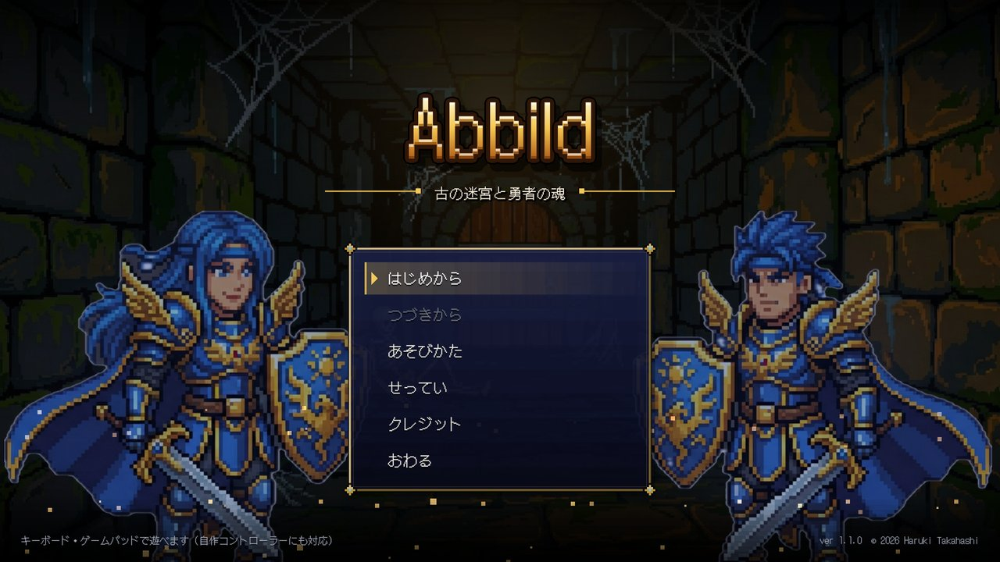
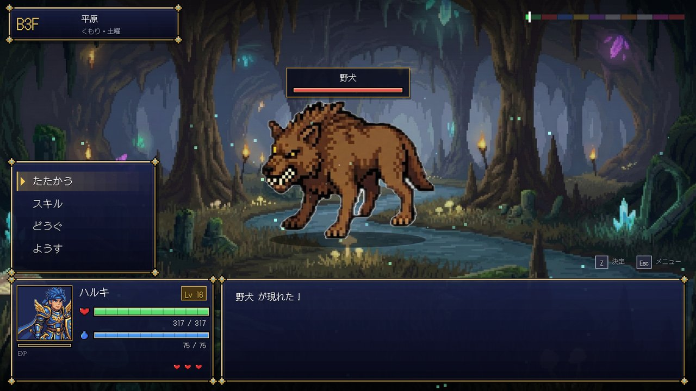
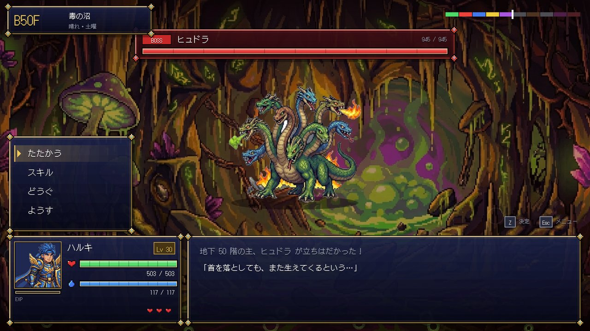
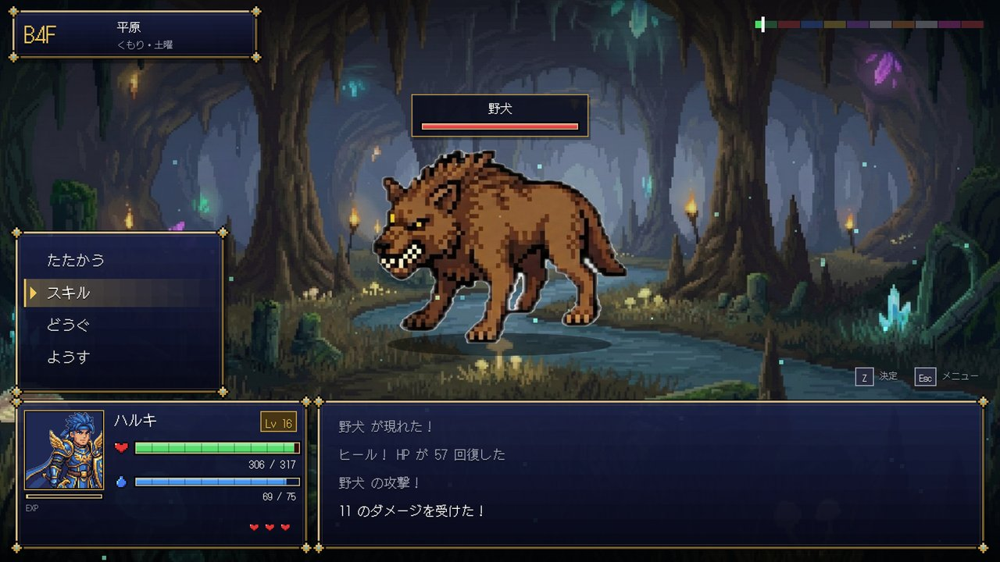
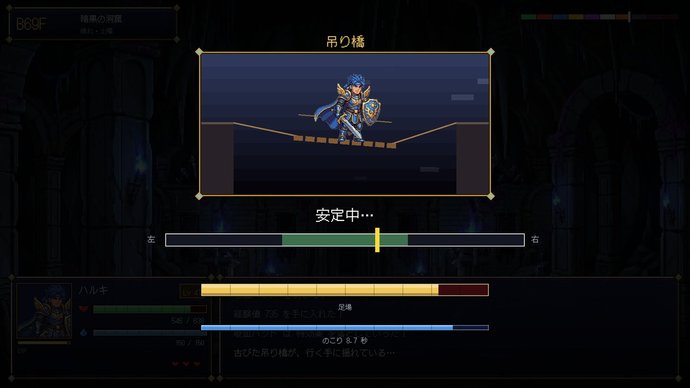

# Abbild ～ 古の迷宮と勇者の魂 ～

**体で遊ぶ、100 階層のダンジョン RPG。**
心拍・振り・傾き・息で戦う自作コントローラーにも、ふつうのキーボード・ゲームパッドにも対応しています。



| 戦闘 | ボス |
| --- | --- |
|  |  |
| **瞑想（呼吸のガイド）** | **凝視（心拍検知）** |
|  |  |

## どんなゲームか

- 地下 1 階から 100 階まで、1 階ごとに 1 戦。10 階ごとにボス、最深部に真・魔王。
- 10 種類のバイオーム（平原・火山・氷河・砂漠・毒の沼・神殿・暗黒の洞窟・神界・魔界・終焉）。場所ごとに効果と弱点の属性がある。
- 敵は 100 種類以上。曜日限定（花金スライム・ブルーマンデー・サンデー・デビル）や、ネタ枠（お母さん・締め切り・開発者の怨念）も出る。
- **体を使うミニゲーム 20 種類**
  - 敵の凝視：心を静めて気配を消す
  - 居合い：合図の瞬間に反応する
  - 心眼：暗闇で光と音を頼りにかわす
  - 宝箱の解錠、吊り橋、釣り、錬金、鍛冶、交渉、第六感、蘇生など
- 最初の能力はキャラ作成時の測定で決まる。
  - 心＝体力：心拍、または鼓動のリズム
  - 技＝素早さ：振った回数
  - 力＝攻撃力：連打した回数
- 難しさは 3 段階。蘇生のチャンスの回数がちがう。

## 操作

| 操作 | キーボード | ゲームパッド | 自作コントローラー |
| --- | --- | --- | --- |
| 選ぶ | ↑↓←→ / WASD | 十字キー・左スティック | 方向ボタン |
| 決定 | Z / Enter / Space | A | 決定ボタン |
| もどる | X / Backspace / Esc | B | もどるボタン |
| メニュー | Esc / Tab | START | － |
| 振る | ← → を交互に押す | スティックを左右にはじく | 本体を振る |
| 傾ける | ← → を押し続ける | スティック | 本体を傾ける |
| 息 | C を押し続ける | Y | 湿度センサーに息を吹きかける |
| 心拍 | 呼吸のガイドに合わせて決定を押す・離す／連打で高ぶる | 同左 | 心拍センサー |
| 画面の切り替え | F11 / Alt+Enter | － | － |

マウスでもメニューを選べます。

## 自作コントローラー（任意）

`firmware/AbbildController/AbbildController.ino` が対応するスケッチです（部品と配線は [firmware/README.md](firmware/README.md)）。
WinForms 版のころの形式（`pulse,sw,x,y,z,temp,hum`）も読めるので、前のコントローラーもそのまま使えます。
つなぐと自動でポートを探します。値は「せってい → センサーの確認」で見られます。

## 作り（開発者向け）

```
src/Abbild.Core/   ルールだけの部分（画面に依存しない。テスト対象）
  Battle.cs          戦闘のルール（出来事のリストを返す）
  Challenges.cs      ミニゲーム 20 種類（入力 → 判定）
  Body.cs            体の入力の形・キーボード用の心拍シミュレーション
  ControllerProtocol.cs  コントローラーとの通信形式（v1 / v2）
  Enemies.cs / Items.cs / Skills.cs / Hero.cs / Persistence.cs
src/Abbild/        MonoGame（DesktopGL）の画面
  Scenes/            タイトル・キャラ作成・迷宮・ゲームオーバー・エンディング・設定
  Ui/ChallengeView.cs  ミニゲームの表示
  Controller/        シリアル通信・体の入力をまとめる
  Engine/            描画・音（BGM はその場で読み出し、効果音は合成）・入力
tests/Abbild.Tests/ 単体テストと、自動プレイヤーによる難しさの確認
tools/prepare_assets.py  元の素材から画像・音を作る（透過・縮小・Ogg 化）
firmware/          Arduino のスケッチ
```

```bash
dotnet build Abbild.slnx
dotnet test --solution Abbild.slnx
dotnet run --project src/Abbild                # 遊ぶ
dotnet run --project src/Abbild -- --windowed  # ウィンドウで起動
# 配布用（Windows、.NET のインストール不要）
dotnet publish src/Abbild -c Release -r win-x64 --self-contained -o publish/Abbild
```

動作確認用の起動オプション:

- `--snapshots <フォルダー>`：決まった画面を順に撮影する
- `--autoplay <秒>`：でたらめな操作で遊び続ける（落ちないことの確認）
- `--snapshots <フォルダー> --only fx`：戦闘の演出を種類ごとに撮影する
- `--snapshots <フォルダー> --only challenges`：ミニゲームの画面を種類ごとに撮影する
- `--snapshots <フォルダー> --only motion`：動き（演出）を数フレームおきに撮影する
- `--data <フォルダー>`：セーブの置き場所を変える

難しさは自動プレイヤー（`tests/Abbild.Tests/Bot.cs`）で何百回も遊ばせて調整しています。ミニゲームの成功率が 6 割の人でのクリア率は次のとおりです。

| 難しさ | クリア率 |
| --- | --- |
| やさしい | 約 9 割 |
| ふつう | 約 5 割 |
| きびしい | 1 割未満（成功率 9 割の人で約 5 割） |

セーブ・設定は `%APPDATA%\Abbild` に保存されます。

## 素材と権利

[docs/ASSETS.md](docs/ASSETS.md) にまとめています（販売前に確認が必要なものも書いてあります）。

## ライセンス

プログラム © 2026 Haruki Takahashi. All rights reserved.
使っているライブラリ・フォントは [THIRD_PARTY_NOTICES.md](THIRD_PARTY_NOTICES.md) を参照してください。
